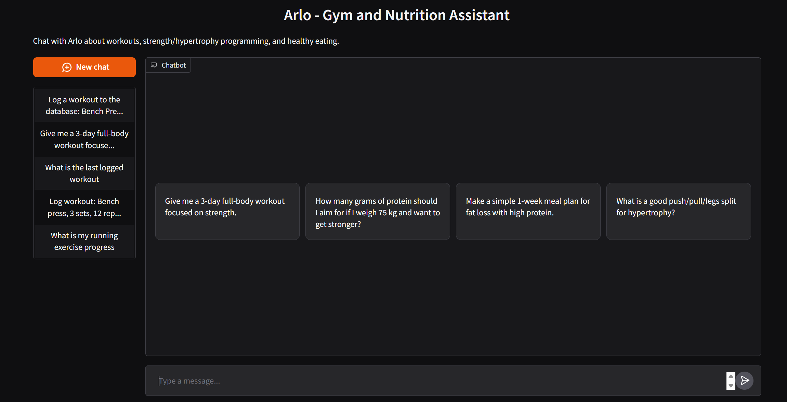
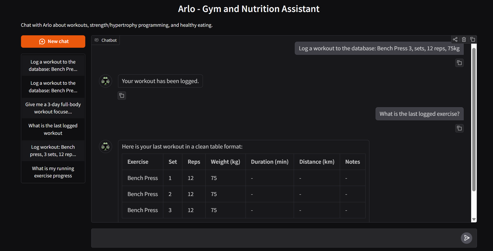
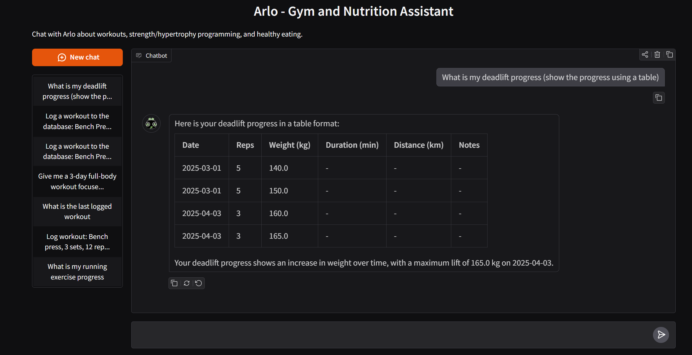
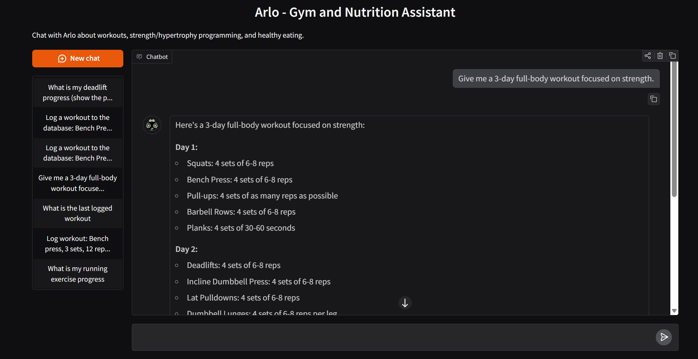
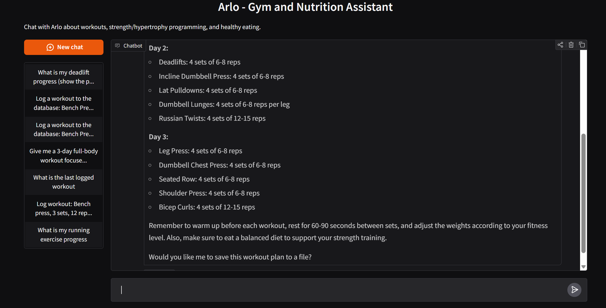
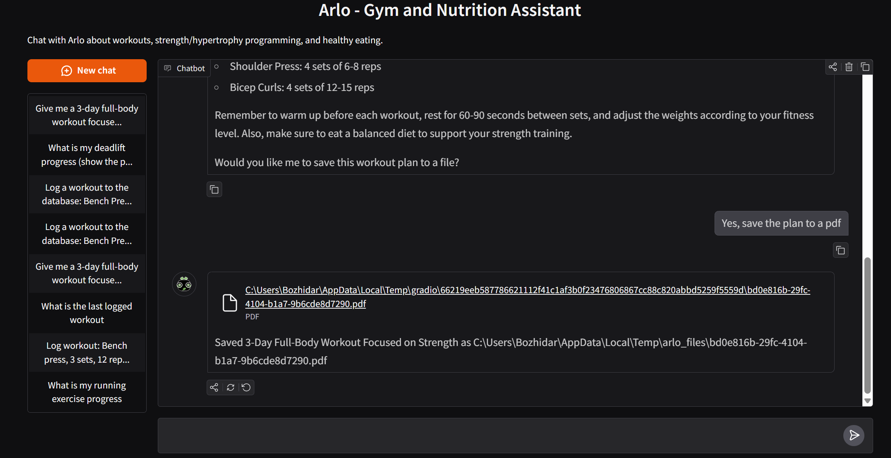

# Arlo - Gym and Nutrition Assistant


### Arlo is an AI-powered workout, nutrition, and progress tracking chatbot

---

## Features

- Focus on gym training, hypertrophy/strength, and healthy eating
- Tool-based workout logging with validation for sets, reps, weight, cardio metrics, and dates
- Exercise progress lookup from the stored workout history
- Last-workout lookup rendered as a Markdown table with all sets
- Delete-last-workout action (removes workout and cascades to related sets)
- Export plans and routines to **TXT**, **Markdown**, or **PDF**
- Persistent storage with **SQLite**
- Persistent chat history
- Browser-based interface with **Gradio**
- Containerized setup with **Docker Compose**

---

## Tech Stack

[](https://www.python.org/)
[](https://www.gradio.app/)
[](https://www.langchain.com/)
[](https://console.groq.com/docs/quickstart)
[](https://www.sqlite.org/)
[](https://www.docker.com/)

- **App UI**: Gradio ChatInterface
- **LLM Orchestration**: LangChain agent + tools
- **Model Provider**: Groq (The default model is `llama-3.3-70b-versatile`, but it can be changed with the `MODEL` environment variable)
- **Database**: SQLite (`fitness.db`)
- **Runtime/Packaging**: Python 3.11 + uv + Docker

---

## How It Works

1. User sends a fitness/nutrition question in the chat UI.
2. The LangChain agent applies a strict system prompt (fitness-only scope).
3. If needed, Arlo calls tools to:
   - log workouts
   - fetch exercise progress
   - fetch last logged workout
   - delete last logged workout
   - save plans to TXT/MD/PDF
4. Workout data is validated and stored in SQLite.
5. Arlo returns a final answer (and downloadable file if requested).

### Demo

#### Initial Screen (also when you click `New Chat` )


#### Workout Logging Example


#### Progress Query Example


### Workout Plan Generation and File Saving Example




#### Exported Plan Example

📄[The generated workout plan](assets/demo/files/bd0e816b-29fc-4104-b1a7-9b6cde8d7290.pdf)

---

## Quick Start

### Requirements

- Python 3.11+
- [uv](https://docs.astral.sh/uv/)
- Groq API key ([Groq Quickstart](https://console.groq.com/docs/quickstart))

### Clone the repo

```sh
git clone https://github.com/BozhidarMindov/arlo-gym-nutrition-assistant.git
```

### Environment Variables (`.env`)

Create `.env` in the project root (used by both Local and Docker setup):

```dotenv
GROQ_API_KEY=<your_key> # Required
GRADIO_SECRET=<your_secret> # Required for a persistent chat history
GRADIO_STORAGE_KEY=<your_storage_key> # Required for a persistent chat history
MODEL=<desired_groq_model> # Optional (default=llama-3.3-70b-versatile)
FITNESS_DB_PATH=<desired_db_path> # Optional (default=fitness.db)
GRADIO_TEMP_DIR=<optional_temp_dir> # Optional (Random is used by default)
```

### Local Setup

1. Install dependencies:

```sh
uv sync
```

2. Run the app:

```sh
uv run python src/app.py
```

3. Open in browser: `http://localhost:7860`

### Docker Setup

```sh
docker compose up -d --build
```

Then open `http://localhost:7860`.

---

## Notes

- Arlo is intentionally restricted to gym and nutrition topics.
- Generated files are stored in a temp directory configured via `GRADIO_TEMP_DIR`. If not configured, a random tempdir will be used.
- This project was completed as part of the **AI for Big Data course** in the **Big Data Technologies** master's program at **Sofia University**/**GATE Institute**.
